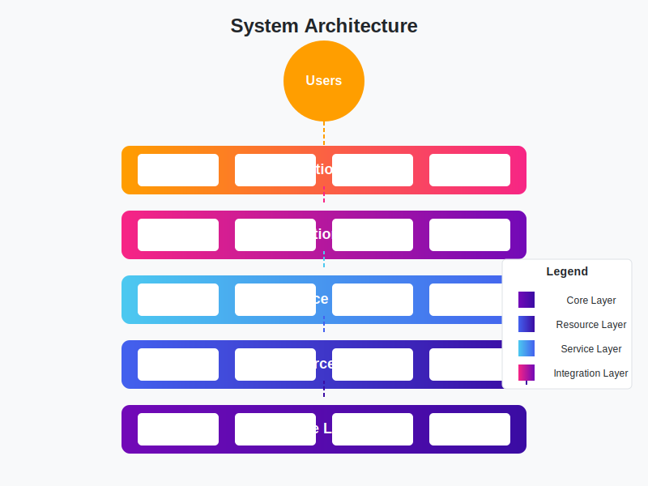
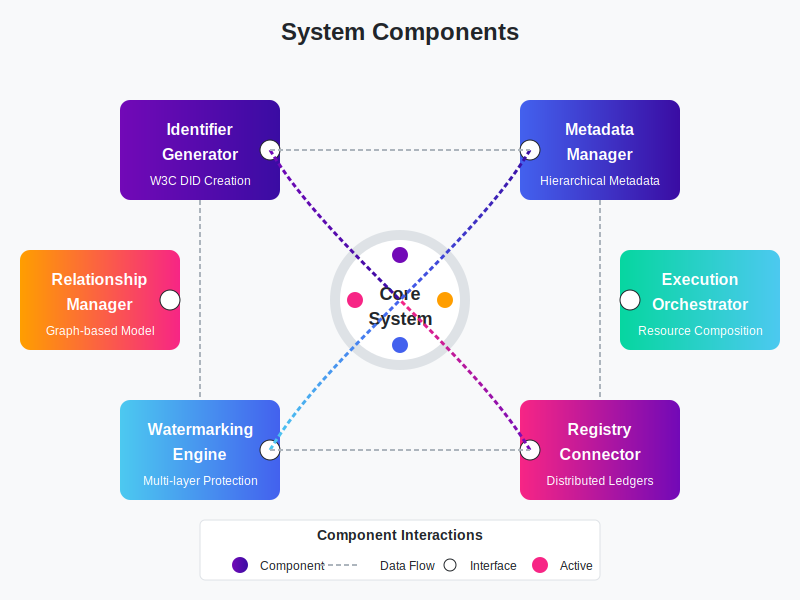
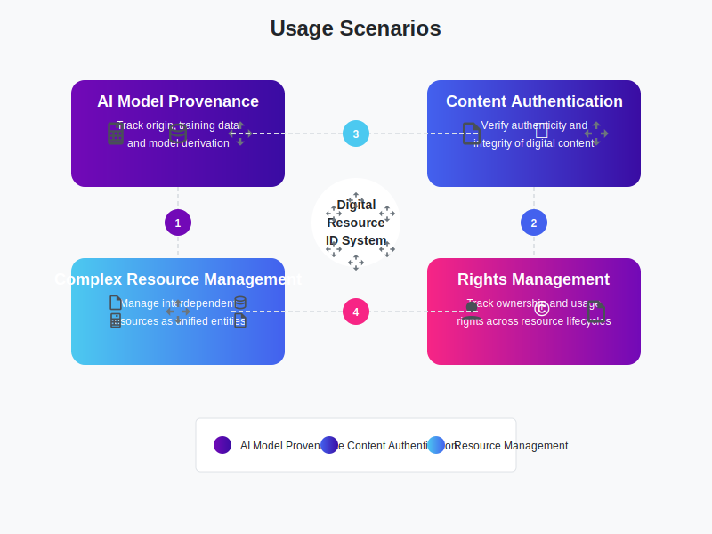

# Decentralized Digital Resource Integrated ID System

A comprehensive system for decentralized identification, verification, and management of diverse digital resources including text, images, audio, video, AI models, and datasets.

## Overview

The Decentralized Digital Resource Integrated ID System provides a comprehensive framework for managing digital resources in a decentralized environment. It enables:

- **Unified Identification**: Generate and manage decentralized identifiers (DIDs) for diverse digital resources
- **Comprehensive Metadata**: Hierarchical metadata structure integrating multiple standards
- **Robust Verification**: Multi-layered watermarking and cryptographic verification
- **Resource Relationships**: Graph-based modeling of relationships between resources
- **Execution Capabilities**: Orchestration mechanisms for complex digital resources
- **Distributed Registry**: Blockchain-based registry for immutable provenance records

## Key Components

### 1. Identifier Generation

Using W3C DID standards to create persistent, decentralized identifiers for digital assets with:
- Asset-specific DID methods
- Compressed representations
- Cryptographic signatures
- Resolution mechanisms

### 2. Hierarchical Metadata

A layered metadata structure combining multiple standards:
- DID for basic identification
- C2PA for provenance and integrity
- Asset-specific schemas (Model Cards, Open Datasheets)
- W3C PROV for comprehensive provenance graphs
- Rights management frameworks

### 3. Multi-layer Watermarking

Resource-specific watermarking techniques:
- Text: Unicode space manipulation, punctuation variations
- Images: Spatial and transform domain techniques
- AI Models: Combined whitebox and blackbox approaches
- Verification service endpoints

### 4. Relationship Management

Graph-based modeling of resource relationships:
- Structural relationships (contains, isPartOf)
- Provenance relationships (derivedFrom, generatedBy)
- Dependency relationships (dependsOn, requires)
- W3C PROV ontology integration

### 5. Execution Structure

Mechanisms for orchestrating complex digital resources:
- Resource composition manifests
- Dependency graphs
- Execution sequencing
- Interface definitions
- Environment requirements

### 6. Distributed Registry

Blockchain-based registry with:
- On-chain core metadata and event records
- Off-chain storage for large metadata
- Smart contracts for rights management
- Verifiable Credentials integration

## Architecture

The system follows a layered architecture pattern:

1. **Core Layer**: Fundamental identification and cryptographic operations
2. **Resource Layer**: Type-specific resource handling
3. **Service Layer**: Functional services (registration, verification, query)
4. **Integration Layer**: External system integrations
5. **Application Layer**: User-facing applications and interfaces

## Implementation

The implementation is organized into core components:

- **Identifier Generator**: Creates DIDs for various resource types
- **Metadata Manager**: Handles hierarchical metadata creation and management
- **Watermarking Engine**: Applies and verifies resource-specific watermarks
- **Registry Connector**: Interfaces with distributed ledger technologies
- **Relationship Manager**: Maintains resource relationship graphs
- **Execution Orchestrator**: Manages complex resource execution

## Usage Scenarios

1. **AI Model Provenance**: Track the origin, training data, and derivation of AI models
2. **Content Authentication**: Verify the authenticity and integrity of digital content
3. **Complex Resource Management**: Manage interdependent resources as unified entities
4. **Rights Management**: Track ownership and usage rights across resource lifecycles

## Getting Started

See the [deployment guide](deployment/README.md) for instructions on setting up the system.

## Project Structure

- `src/`: Source code implementing the system components
- `doc/`: Documentation including specifications and guides
- `deployment/`: Deployment configurations and scripts
- `Scientific_papers/`: Research papers and standards references

Patent Pending
