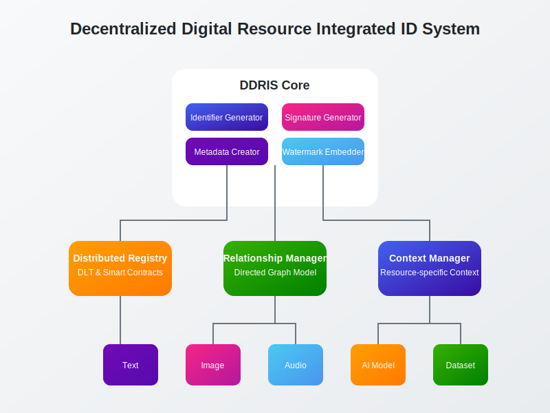
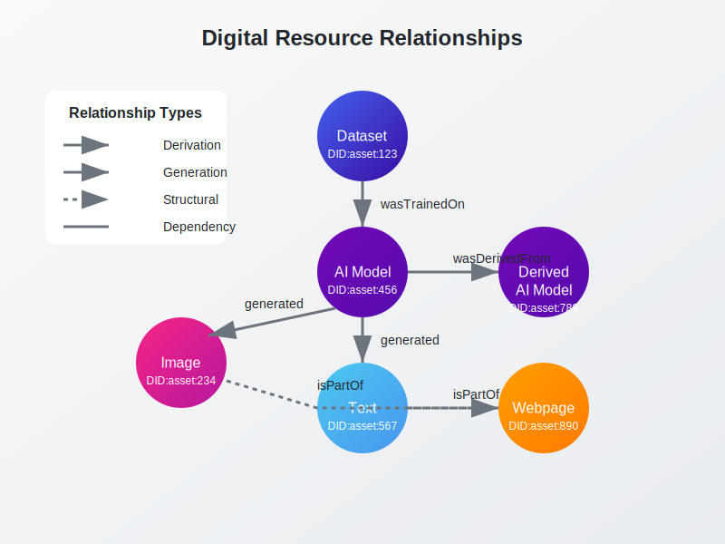

# Decentralized Digital Resource Integrated ID System (DDRIS)

DDRIS is a comprehensive framework for managing digital resources across distributed environments. It provides a unified identification and management system for various types of digital assets including text, images, audio, video, AI models, datasets, and executable code.

## Overview

In modern digital environments, diverse types of digital resources are created and distributed. These resources are easily replicated, modified, and redistributed through the internet, creating challenges in original identification, source tracking, ownership verification, and integrity validation.

DDRIS addresses these challenges through:

1. **Unified Identification** - Creates, manages, and utilizes integrated identifiers across distributed environments
2. **Metadata Management** - Provides hierarchical metadata structures tailored to different resource types
3. **Ownership Validation** - Ensures traceable ownership and provenance of digital resources
4. **Integrity Verification** - Validates the integrity of resources using cryptographic techniques
5. **Relationship Management** - Defines and manages relationships between multiple digital resources

## Key Components

### DID-Based Identification

DDRIS uses W3C Decentralized Identifiers (DIDs) as the foundation for resource identification:

- Resource-specific DID methods tailored to different asset types
- Integration with existing identifier systems (DOI, SWHID)
- Compressed encoding for efficient storage and transmission
- Digital signatures for authentication and integrity verification

### Hierarchical Metadata Architecture

The system implements a layered metadata strategy:

- **Base Layer** - DID and fundamental resource information
- **Provenance Layer** - C2PA manifest for cryptographically-bound provenance information
- **Resource-Specific Layer** - Asset-type specific metadata (Model Cards, Open Datasheets)
- **Lineage Layer** - W3C PROV-based comprehensive lineage information
- **Rights Management Layer** - License and usage rights information

### Multi-Layer Watermarking

Different watermarking techniques are applied based on resource type:

- **Text** - Unicode space character utilization, punctuation variations
- **Images** - LSB insertion, frequency domain techniques
- **Audio** - Spectrum analysis and inaudible region insertion
- **AI Models** - Combined whitebox (parameter-based) and blackbox (output distribution) watermarking

### Distributed Registry

- Blockchain-based immutable record of identifiers and ownership
- Off-chain storage for large metadata using IPFS
- Smart contracts for automated rights management
- Verifiable Credentials for participant authentication

### Resource Relationship Management

Resources are interconnected through directed graph relationships:

- Structural relationships (contains, isPartOf)
- Derivation relationships (derivedFrom, basedOn)
- Reference relationships (references, cites)
- Dependency relationships (dependsOn, requires)

### Execution Structure Metadata

For executable digital resources, DDRIS provides:

- Component resource list management
- Dependency graph definition
- Execution sequence orchestration
- Interface definition
- Environment requirements specification

## Technical Implementation

### Workflow

1. Resource attribute collection
2. DID generation based on W3C standards
3. Cryptographic signature creation
4. Hierarchical metadata structure generation
5. Metadata embedding through multi-layer watermarking
6. Distributed ledger registration
7. Resource relationship definition
8. Context-specific information management

### Integration Points

DDRIS integrates with multiple existing standards:

- W3C DID for resource identification
- C2PA for provenance and integrity
- Model Cards & Open Datasheets for AI resources
- W3C PROV for lineage tracking
- MPEG-21 REL for rights expression

## Getting Started

*Documentation on implementation and usage coming soon*

## License

*License information to be determined*

*Patent Pending*